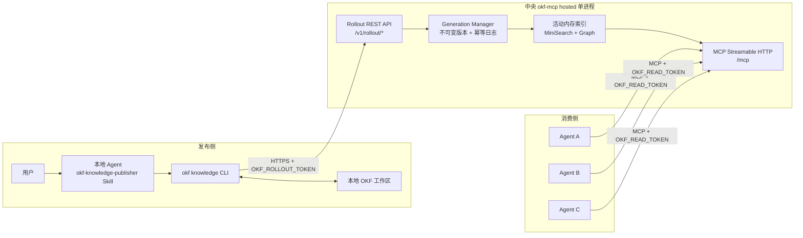

# okf-mcp 0.9.0 中文用户指南

> **版本与发布状态**
>
> 本文档描述的是当前源码中声明的版本 `0.9.0`，即 `package.json`、`package-lock.json` 和 `server.json` 中的版本号。
> 截至本文档编写时，仓库尚未创建正式的 `v0.9.0` Git Tag 或 GitHub Release，也未发布 `@doctormacky/okf-mcp@0.9.0` npm 包。
>
> 因此，本文中的“0.9.0”表示**源码声明版本**，不表示该版本已经正式发布。部署时应固定到经过验证的具体 Git Commit；待 `v0.9.0` Tag 或 GitHub Release 正式创建后，再改为固定对应 Tag 或 Release 归档。

## 1. 产品定位

`okf-mcp` 是 Open Knowledge Format（OKF）v0.2 的验证器、图索引、命令行工具和 MCP 服务器。

当前源码声明的包身份为：

```text
@doctormacky/okf-mcp
```

MCP Registry 身份为：

```text
io.github.doctormacky/okf-mcp
```

当前 fork 主要以源码和源码运行包方式分发。不要假定以下制品已经存在：

- `v0.9.0` Git Tag
- GitHub `v0.9.0` Release
- `@doctormacky/okf-mcp@0.9.0` npm 包
- 可直接安装的 MCP Registry 条目

产品可以承担三个主要角色：

1. **MCP 服务器**：通过 stdio 或 Streamable HTTP 向 Agent 提供 OKF 查询能力。
2. **知识发布器**：通过内置 Skill 和 `okf knowledge` CLI 完成受控发布。
3. **Agent 知识源**：让用户的 Agent 通过远程 MCP 搜索、读取和遍历中央知识。

## 2. 快速架构



推荐生产拓扑：

```text
Agent
  -> HTTPS / 企业反向代理
  -> 127.0.0.1:8790
  -> okf hosted
```

发布和消费使用不同凭据：

```text
OKF_READ_TOKEN     -> 仅 MCP 读取
OKF_ROLLOUT_TOKEN  -> 快照下载、dry-run、submit；不能调用 MCP
```

两个 Token 必须非空且不同。

# 第一部分：基础准备

## 3. 前置条件

### 3.1 运行环境

必须具备：

- Node.js 22 或更高版本
- Git
- 可写的 OKF Bundle 根目录
- 对 Bundle 父目录或项目根目录的写权限，用于 Generation Store
- 生产环境中的 TLS 终止或可信内部反向代理

检查版本：

```bash
node --version
git --version
```

### 3.2 不需要数据库

当前实现不依赖：

- 数据库
- 向量数据库
- Embedding 服务
- 外部托管知识平台
- 构建步骤
- GitLab 或 GitHub 发布流程

搜索使用进程内 MiniSearch BM25+，图结构同样保存在内存索引中。

## 4. 从源码安装

### 4.1 固定源码提交

由于目前尚无正式的 `v0.9.0` Tag 或 GitHub Release，生产部署应固定到团队已验证的具体 Commit：

```bash
git clone https://github.com/doctormacky/okf-mcp.git
cd okf-mcp

git checkout <经过验证的完整-commit-sha>
```

不要在生产环境直接跟随移动的 `main` 分支。

确认源码声明版本：

```bash
node -p "require('./package.json').version"
```

预期：

```text
0.9.0
```

这只验证源码元数据，不代表当前 Commit 已经属于正式 Release。

### 4.2 开发或完整验证安装

```bash
npm ci
npm test
npm run self:validate
npm run package:smoke

node bin/okf-mcp.js --version
```

预期：

```text
0.9.0
```

### 4.3 仅运行时安装

在已完成测试的源码目录中：

```bash
npm prune --omit=dev
```

之后可直接运行：

```bash
node /opt/okf-mcp/bin/okf-mcp.js --version
```

也可建立稳定命令：

```bash
#!/usr/bin/env bash
set -euo pipefail
exec node /opt/okf-mcp/bin/okf-mcp.js "$@"
```

将该脚本安装为：

```text
/usr/local/bin/okf
```

然后验证：

```bash
okf --version
okf knowledge --help
```

### 4.4 构建源码运行包

完成测试后：

```bash
npm prune --omit=dev

tar \
  --exclude=.git \
  --exclude=node_modules/.cache \
  -czf okf-mcp-runtime-0.9.0-<short-commit>.tar.gz \
  bin src node_modules package.json package-lock.json okf .agents docs \
  okf.project.yaml server.json README.md README_zh.md LICENSE
```

建议在制品清单中同时记录：

```text
source_version=0.9.0
git_commit=<完整 Commit SHA>
build_time=<UTC 时间>
formal_release=false
```

不要只使用 `0.9.0` 作为当前源码运行包的唯一标识，因为在正式 Tag 发布前，不同 Commit 都可能声明相同源码版本。

## 5. OKF 目录布局

### 5.1 单 Bundle Root

最简单的目录：

```text
/data/catalog/
├── index.md
├── services/
│   ├── order-api.md
│   └── payment-api.md
├── workflows/
│   └── cancel-order.md
└── policies/
    └── refund-policy.md
```

普通概念文件示例：

```markdown
---
type: Workflow
title: Cancel Order
description: Cancels an eligible order before fulfillment.
tags: [orders, cancellation]
---

# Cancel Order

Only unfulfilled orders may be cancelled.

See [Refund Policy](../policies/refund-policy.md).
```

每个非保留 Markdown 概念必须：

- 有可解析的 YAML frontmatter
- 有非空 `type`
- 使用安全的 Bundle 内相对路径
- 不使用隐藏路径，例如 `.private/doc.md`
- 不使用路径穿越，例如 `../outside.md`

### 5.2 Project 模式

需要联邦多个本地 Bundle 时使用 `okf.project.yaml`：

```yaml
project: EnterpriseKnowledge
strictLinks: false

bundles:
  - id: app
    root: bundles/app
    include: ["**/*.md"]
    exclude: ["archive/**"]

  - id: data
    root: bundles/data

relationTypes:
  - depends_on
  - produces
  - consumes
  - persists_to
  - configured_by
  - checked_by
  - related_to
```

验证：

```bash
okf --project /data/knowledge/okf.project.yaml validate
```

### 5.3 Root 与 Project 选择

单 Root：

```bash
okf --root /data/catalog validate
```

Project：

```bash
okf --project /data/knowledge/okf.project.yaml validate
```

`--root` 不能和 `--project`、`--bundle` 同时使用。

# 第二部分：MCP 服务器角色

## 6. 三种 MCP 运行方式

### 6.1 stdio MCP

适合：

- 本地 Agent
- 桌面 MCP 客户端
- 单用户开发环境
- 客户端可以启动本地子进程的场景

启动：

```bash
okf --root /absolute/path/to/catalog mcp
```

Project 模式：

```bash
okf --project /absolute/path/to/okf.project.yaml mcp
```

stdio 模式不提供网络监听，也不需要 HTTP Token。

### 6.2 低层 `mcp --http`

适合本机开发或受控兼容性测试：

```bash
okf --root /data/catalog mcp --http \
  --host 127.0.0.1 \
  --port 8766
```

端点：

```text
http://127.0.0.1:8766/mcp
```

该模式本身不提供 Hosted Token 认证。

非 Loopback 地址默认被拒绝。只有显式加入以下高风险选项才允许：

```bash
--insecure-http
```

生产环境不推荐使用该模式公开服务。

### 6.3 推荐：`hosted`

`hosted` 在一个 Node.js 进程中同时运行：

- 认证 MCP Streamable HTTP
- Rollout REST API
- Generation Manager
- 当前活动内存索引
- 单写入协调器

启动：

```bash
export OKF_READ_TOKEN='agent-read-token'
export OKF_ROLLOUT_TOKEN='publisher-write-token'

okf --root /data/catalog hosted \
  --host 127.0.0.1 \
  --port 8790
```

Project 模式：

```bash
okf --project /data/knowledge/okf.project.yaml hosted \
  --host 127.0.0.1 \
  --port 8790
```

Hosted 要求：

- 两个 Token 非空且不同
- Token 只能来自环境
- 不和 `--authoring`、`--write`、`--git-commit`、`--allow-remote-tool`、`--allow-computation-authoring` 一起使用

## 7. Hosted 端点

| 方法 | 路径 | 认证 | 用途 |
| --- | --- | --- | --- |
| `GET` | `/health` | 无 | 进程健康检查 |
| `POST/GET/DELETE` | `/mcp` | 仅读 Token | MCP Streamable HTTP |
| `GET` | `/v1/rollout/snapshot` | 读或写 Token | 下载活动快照 |
| `GET` | `/v1/rollout/status` | 读或写 Token | 查询 Revision 和 Generation |
| `POST` | `/v1/rollout/dry-run` | 仅写 Token | 验证并签发 Preview |
| `POST` | `/v1/rollout/submit` | 仅写 Token | 发布 Preview |

健康检查：

```bash
curl -fsS http://127.0.0.1:8790/health
```

## 8. 认证边界

MCP 请求：

```http
Authorization: Bearer <OKF_READ_TOKEN>
```

- 缺失 Token：`401`
- 错误 Token：`403`
- 写 Token 调用 MCP：`403`

Rollout 变更请求：

```http
Authorization: Bearer <OKF_ROLLOUT_TOKEN>
```

读 Token 调用 dry-run 或 submit 返回 `403`。

不要在命令参数、Skill、Bundle、Git 或日志中保存 Token。

## 9. TLS 与反向代理

内置 Hosted 监听器只提供 HTTP。生产环境应：

1. Hosted 绑定 `127.0.0.1`。
2. 反向代理终止 TLS。
3. 保留 `Authorization` 头。
4. 允许 `POST`、`GET`、`DELETE`。
5. 支持流式响应和较长连接。
6. 避免对 MCP 流进行不必要缓冲。

示例：

```nginx
location / {
    proxy_pass http://127.0.0.1:8790;
    proxy_http_version 1.1;
    proxy_set_header Host $host;
    proxy_set_header Authorization $http_authorization;
    proxy_buffering off;
    proxy_read_timeout 3600s;
}
```

## 10. 不可变 Generation 与恢复

Hosted 从 Generation Store 提供服务，而不是持续读取可修改 Root。

Root 模式默认 Generation Store：

```text
<root父目录>/.<root目录名>.okf-generations
```

Project 模式：

```text
<project-root>/.okf-generations
```

结构：

```text
.okf-generations/
├── <bundle-id>/
│   ├── active.json
│   └── gen_.../
│       ├── manifest.json
│       └── files/
├── previews/
└── idempotency/
```

发布时先写完整候选、构建未来索引、验证，再原子切换活动指针和内存索引。

默认保留最近 5 个 Generation，最少 2 个。这不替代正式备份。

启动时会校验：

- Manifest
- 文件存在性
- 普通文件类型
- 每个文件 SHA-256
- 字节数
- 整体 Revision
- Candidate Digest
- 完整项目索引

损坏时尝试回退到最近的有效 Generation；如果全部损坏，Hosted 拒绝启动。

## 11. MCP 工具

### 11.1 概念与发现

```text
list_bundles
list_concepts
get_concept
search_concepts
list_types
list_tags
list_relation_types
list_edge_kinds
```

### 11.2 图查询

```text
get_graph
get_neighbors
get_subgraph
find_paths
graph_summary
export_graph
```

### 11.3 溯源与资源

```text
get_provenance
read_bundle_asset
read_git_source
```

### 11.4 静态计算

```text
inspect_attested_computation
prepare_attested_computation
check_computation_receipt
```

### 11.5 验证与迁移

```text
check_v02_migration
validate_bundle
validate_project
```

### 11.6 远程 Bundle

```text
list_remote_bundles
load_remote_bundle
```

`load_remote_bundle` 仅在 `--allow-remote-tool` 下启用，Hosted 不启用。

### 11.7 提案与直接写工具

```text
okf_validate_concept
okf_suggest_concept_path
okf_propose_concept
okf_propose_update
okf_propose_attested_computation
okf_propose_v02_migration
okf_list_proposals
okf_get_proposal
okf_accept_proposal
okf_reject_proposal
okf_validate_changes
okf_apply_changes
```

这些属于本地创作模式。Hosted 不暴露它们。

## 12. MCP 能力门控

| 模式 | 提案 | 直接写 | 计算提案 | 远程加载 |
| --- | ---: | ---: | ---: | ---: |
| 默认 stdio/低层 HTTP | 否 | 否 | 否 | 否 |
| `--authoring` | 是 | 否 | 否 | 否 |
| `--write --actor ...` | 否 | 是 | 否 | 否 |
| `--authoring --allow-computation-authoring` | 是 | 否 | 是 | 否 |
| `--allow-remote-tool` | 否 | 否 | 否 | 是 |
| `hosted` | 否 | 否 | 否 | 否 |

Hosted 只保留读取、搜索、图、溯源、验证和静态计算检查工具。

## 13. MCP 客户端配置

### 13.1 通用 Streamable HTTP 配置

不同客户端 Schema 可能不同，常见形式：

```json
{
  "mcpServers": {
    "okf": {
      "transport": "streamable-http",
      "url": "https://knowledge.internal.example/mcp",
      "headers": {
        "Authorization": "Bearer <OKF_READ_TOKEN>"
      }
    }
  }
}
```

其他客户端可能使用：

```json
{
  "mcpServers": {
    "okf": {
      "url": "https://knowledge.internal.example/mcp",
      "headers": {
        "Authorization": "Bearer <OKF_READ_TOKEN>"
      }
    }
  }
}
```

应查阅具体客户端文档，不要假定字段名完全一致。

### 13.2 stdio 配置

```json
{
  "mcpServers": {
    "okf": {
      "command": "node",
      "args": [
        "/absolute/path/to/okf-mcp/bin/okf-mcp.js",
        "--root",
        "/absolute/path/to/catalog",
        "mcp"
      ]
    }
  }
}
```

### 13.3 工具调用顺序

推荐 Agent 首先执行：

```text
list_bundles
  -> search_concepts / list_concepts
  -> get_concept
  -> get_neighbors / get_graph
  -> get_provenance
```

MCP 客户端会完成：

```text
initialize
notifications/initialized
tools/list
resources/list
tools/call
resources/read
```

不要手工用 `curl` 模拟完整 MCP Session。普通健康检查和 Rollout 状态可以使用 `curl`。

# 第三部分：Publisher 角色

## 14. 发布工作流

内置 Skill：

```text
.agents/skills/okf-knowledge-publisher/SKILL.md
```

严格流程：

```text
download
  -> enrich
  -> server dry-run
  -> explicit confirmation
  -> submit
  -> MCP verify
```

### 14.1 设置写 Token

```bash
export OKF_ROLLOUT_TOKEN='publisher-write-token'
```

### 14.2 下载

```bash
okf knowledge download \
  --url https://knowledge.internal.example \
  --out ./okf-work
```

多 Bundle：

```bash
okf knowledge download \
  --url https://knowledge.internal.example \
  --bundle app \
  --out ./okf-work
```

工作区会包含权限为 `0600` 的：

```text
.okf-knowledge.json
```

它保存：

- URL
- Bundle
- Base Revision
- Generation ID
- 文件摘要
- Preview
- 幂等键
- bounded diff

不保存 Token。

### 14.3 Enrich

在工作区内编辑 Markdown：

- 保留未知字段
- 不虚构事实
- 保持路径稳定
- 不使用符号链接
- 删除文件表示请求删除该概念
- 非 Markdown 文件不属于 Rollout 候选快照

### 14.4 服务端 Dry-run

```bash
okf knowledge submit \
  --workspace ./okf-work \
  --dry-run
```

JSON 输出：

```bash
okf knowledge submit \
  --workspace ./okf-work \
  --dry-run \
  --json
```

服务端返回：

- 路径变更
- `diffText`
- `diffTruncated`
- Validation 诊断
- Submitted Revision
- Current Revision
- Preview ID
- Candidate Digest
- 过期时间

默认 Preview 有效期为 15 分钟。

默认 Diff 限制：

```text
每文件 8 KiB
总计 64 KiB
```

若出现截断标记，必须额外审查未显示部分。

### 14.5 明确确认

Dry-run 成功不等于批准。

有效确认：

```text
确认提交
```

工作区在 Preview 后发生变化时，必须重新 dry-run 并重新确认。

### 14.6 Submit

```bash
okf knowledge submit \
  --workspace ./okf-work \
  --preview-id <preview-id> \
  --message "补充订单取消流程"
```

CLI 会再次显示保存的服务端 Diff，然后要求输入 `y` 或 `yes`。

无人值守场景可添加：

```bash
--yes
```

但不能绕过 Preview、Digest、Revision、验证和幂等检查。

## 15. Preview 与幂等性

Preview 绑定：

- Principal
- Bundle
- Base Revision
- Candidate Digest
- Canonical Request Digest
- 文件数量
- 完整文件内容
- 过期时间

相同幂等 Key 和相同请求会返回同一结果。相同 Key 用于不同请求返回 `409`。

响应丢失或进程在活动指针切换后中断时，相同 Submit 重试会通过持久化日志恢复确定结果。

## 16. 409 处理

出现 `409 Conflict` 时：

1. 停止。
2. 不强制覆盖。
3. 下载最新快照。
4. 重新合并修改。
5. 再次 dry-run。
6. 展示新 Diff。
7. 重新确认。
8. 使用新 Preview 提交。

当前不支持自动三方合并，也没有 `--force`。

## 17. 发布后验证

发布后：

1. 用 `okf knowledge status` 确认活动 Revision。
2. 用 MCP `get_concept` 读取变更概念。
3. 用 `search_concepts` 确认可检索。
4. 用 `get_neighbors` 或 `get_graph` 确认关系。

示例：

```bash
okf knowledge status \
  --url https://knowledge.internal.example \
  --bundle app \
  --json
```

如果发布成功但 MCP 暂时不可用，不要重复 Submit；应报告已发布 Revision 和验证失败。

# 第四部分：Legacy `serve`

## 18. 与 Hosted 区别

推荐：

```bash
okf --root /data/catalog hosted
```

Legacy：

```bash
OKF_WRITE_TOKEN=change-me \
okf --root /data/catalog serve \
  --host 127.0.0.1 \
  --port 8765
```

`serve` 是旧提案 REST API，不是 MCP Transport，也不提供不可变 Snapshot Rollout。

不要让 `serve` 和 `hosted` 同时修改同一 Root。

# 第五部分：故障排查

## 19. 常见问题

| 状态 | 含义 | 处理 |
| --- | --- | --- |
| `401` | 缺少 Token | 设置正确环境变量和 Authorization 头 |
| `403` | Token 错误或角色错误 | MCP 用读 Token；发布用写 Token |
| `409` | Revision 过期或幂等 Key 冲突 | 重新下载、合并、dry-run、确认 |
| `422` | Preview、Digest、路径或 OKF 验证失败 | 查看 Details，修复后重新 dry-run |
| `404` | Bundle、Preview 或资源不存在 | 使用 `list_bundles` 确认 |
| Preview expired | 超过默认 15 分钟 | 重新 dry-run 并确认 |
| Diff truncated | Diff 达到边界 | 额外审查源文件或拆分发布 |
| MCP 不可用 | URL、TLS、Token 或代理错误 | 确认 `/mcp`、读 Token 和 Streamable HTTP |
| Root 修改不生效 | Hosted 不监听 Root | 通过 `okf knowledge` 发布 |
| Hosted 回退 | 活动 Generation 损坏 | 检查磁盘并从备份恢复 |
| Hosted 拒绝启动 | 所有 Generation 损坏 | 恢复完整 Generation Store |
| 工作区符号链接 | CLI 安全拒绝 | 改用普通文件和目录 |
| 请求过大 | Hosted 请求体上限 8 MiB | 减少 Bundle 或拆分 Bundle |

# 第六部分：安全与生产清单

## 20. 安全清单

- [ ] Hosted 绑定 Loopback。
- [ ] 外部访问通过 TLS 反向代理。
- [ ] 读写 Token 不同。
- [ ] Token 为高熵随机值。
- [ ] Token 不进入 argv、Git、Skill、Bundle 或日志。
- [ ] MCP Agent 只获得读 Token。
- [ ] Publisher 只获得写 Token。
- [ ] Generation Store 限制文件系统权限。
- [ ] 不直接编辑 Generation。
- [ ] 不运行多个 Hosted 写进程指向同一 Generation Store。
- [ ] 不使用 `mcp --http --insecure-http` 作为生产方案。
- [ ] 定期备份 Generation Store。
- [ ] 对 Diff 截断设置强制复核规则。

## 21. 生产检查

- [ ] 固定到经过验证的完整 Commit SHA。
- [ ] 记录源码声明版本 `0.9.0`。
- [ ] 明确记录 `formal_release=false`，直到正式 Tag/Release 创建。
- [ ] `npm test` 通过。
- [ ] `npm run self:validate` 通过。
- [ ] `npm run package:smoke` 通过。
- [ ] Root 或 Project 验证通过。
- [ ] TLS 有效。
- [ ] 未认证 MCP 返回 401。
- [ ] 写 Token 调用 MCP 返回 403。
- [ ] 读 Token 调用 dry-run 返回 403。
- [ ] Generation Store 已备份。
- [ ] Submit 后 MCP 立即看到新内容。
- [ ] 重启后仍服务同一活动 Generation。

# 第七部分：10 分钟最小演示

## 22. 准备 Bundle

```bash
mkdir -p /tmp/okf-demo
```

创建 `index.md`：

```markdown
---
okf_version: "0.2"
---

# Demo Knowledge

- [Alpha](./alpha.md)
```

创建 `alpha.md`：

```markdown
---
type: Spec
title: Alpha
description: Initial demo concept.
---

# Alpha

Initial knowledge.
```

验证：

```bash
okf --root /tmp/okf-demo validate
```

## 23. 启动 Hosted

```bash
export OKF_READ_TOKEN='demo-read-token'
export OKF_ROLLOUT_TOKEN='demo-write-token'

okf --root /tmp/okf-demo hosted \
  --host 127.0.0.1 \
  --port 8790
```

## 24. 下载与编辑

```bash
export OKF_ROLLOUT_TOKEN='demo-write-token'

okf knowledge download \
  --url http://127.0.0.1:8790 \
  --out /tmp/okf-work
```

新增 `/tmp/okf-work/beta.md`：

```markdown
---
type: Spec
title: Beta
description: Newly published demo concept.
---

# Beta

Published through the controlled rollout workflow.
```

## 25. Dry-run 与提交

```bash
okf knowledge submit \
  --workspace /tmp/okf-work \
  --dry-run
```

确认 Diff 后：

```bash
okf knowledge submit \
  --workspace /tmp/okf-work \
  --preview-id <preview-id> \
  --message "add beta demo concept"
```

输入：

```text
yes
```

## 26. MCP 验证

配置：

```json
{
  "mcpServers": {
    "okf-demo": {
      "transport": "streamable-http",
      "url": "http://127.0.0.1:8790/mcp",
      "headers": {
        "Authorization": "Bearer demo-read-token"
      }
    }
  }
}
```

调用：

```text
list_bundles
search_concepts
get_concept
get_neighbors
```

# 第八部分：限制与上游归属

## 27. Hosted 限制

- 单进程
- 单写入协调器
- 不支持分布式锁
- 不支持多个写实例共享 Generation Store
- 不支持自动三方合并
- 不支持分片上传
- 请求体默认上限 8 MiB
- 候选最多 5000 个 Markdown 文件
- 无数据库
- 无向量搜索
- 无内置 TLS
- 无文件 Watcher
- Generation 保留有限，不替代正式备份
- Attested Computation 只做静态检查
- Hosted 不开放 MCP 写工具
- Hosted 不开放运行时远程 Bundle 加载

## 28. 版本与正式发布状态

当前源码声明：

```text
version: 0.9.0
```

当前尚未存在：

```text
Git Tag: v0.9.0
GitHub Release: v0.9.0
npm: @doctormacky/okf-mcp@0.9.0
```

在正式发布前，文档、部署清单和运行包应使用：

```text
0.9.0 + 完整 Git Commit SHA
```

作为可复现身份。

当未来创建正式 `v0.9.0` Tag 或 GitHub Release 时，应确保：

1. Tag 指向已通过全部测试的精确 Commit。
2. Release 归档与该 Commit 一致。
3. `package.json`、`package-lock.json` 和 `server.json` 版本一致。
4. `npm test`、`self:validate` 和 `package:smoke` 全部通过。
5. 如发布 npm 包，先验证精确包名和版本。
6. 只有 npm 包真实存在且通过干净 `npx` 验证后，才提交 MCP Registry 元数据。

## 29. 上游归属

本 fork 基于：

```text
https://github.com/mfdaves/okf-mcp
```

当前 fork 增加了：

- 企业快速发布
- 不可变 Generation
- 认证 Hosted 模式
- Publisher Skill
- `okf knowledge` CLI
- bounded 服务端 Diff
- 发布恢复和幂等日志

项目继续遵循 MIT License，并保留原项目及贡献者署名。
